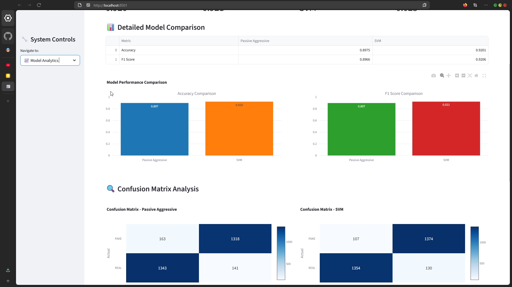

# 🕵️‍♂️ Fake News Detector

<i>Because the internet needed <b>another</b> fake news detector—but this one’s <i>actually good</i>.</i>

Welcome to the <b>Fake News Detector</b>, the overly concerned Python project that’s here to help you separate fact from fiction. Whether you’re tired of miracle mango diets or yet another “Elon buys Mars” headline, this machine learning system will gladly rain on their parade.


### PS: Find the Demo Video Below

---

## 📸 Screenshots

<div style="display: flex; flex-wrap: wrap; gap: 10px;">
  
  
  
  
  
  
</div>

## 🚀 Features

- Text preprocessing that’s cleaner than your browser history.
- <b>Dual-model detection</b>: Support Vector Machine (<i>the nerd who always gets it right</i>) and Passive Aggressive Classifier (<i>the rebel who thrives on confrontation</i>).
- Data visualization for all you graph lovers.
- Confusion matrices that look exactly like how you feel reading fake news.
- Custom article predictions so you can play detective at home.
- <b>Modern Web UI</b> (Streamlit): Because CLI is so 2010.

---

## 🧠 Behind the Scenes

This project uses:

- <b>TF-IDF Vectorizer</b> to turn words into meaningful numbers.
- <b>Passive Aggressive Classifier</b> for its “I don’t care but I actually do” approach.
- <b>SVM</b> because, well, it works. Period.
- Preprocessing includes stemming, stopword removal, regex cleansing, and sarcasm filters (ok, not really).

---

## 📦 Requirements

Install dependencies using:

```bash
pip install -r requirements.txt
```

Or manually, if you like to suffer.

Download the Dataset from my drive:
[WELFake_Dataset.csv](https://drive.google.com/file/d/1wvQvvvDos0EJYv1A3-tPApZdzHACUm6X/view?usp=sharing)

---

## 🛠 How to Run

### Option 1: The Classic Way (Terminal)

1. Clone this amazing repository.
2. Drop your dataset into the root folder (we expect columns named `text` and `label`).
3. Adjust the `DATA_PATH` in `fake_news_detector.py` if you like living dangerously.
4. Run the Python script:

```bash
python fake_news_detector.py
```

Sit back and enjoy as the program judges your articles more critically than your relatives at a wedding.

### Option 2: The Fancy Way (Modern UI)

1. Make sure you’ve installed all requirements (see above).
2. Double-click `run_app.bat` <i>or</i> run:

```bash
streamlit run app.py
```

3. Your browser will open. If it doesn’t, open [http://localhost:8501](http://localhost:8501) yourself. (We believe in you.)
4. Use the beautiful UI to train models, test articles, and see analytics. No command line required!

---

## 🎬 Demo Video

> <b>Watch the magic happen:</b>
>
> [](https://www.youtube.com/watch?v=your-demo-video-id)
>
> <i>Click the thumbnail above to see a full walkthrough of the Fake News Detector in action!</i>

---

# 📊 Sample Output

```
=== Fake News Detection System ===
Loading dataset...
Training models...
Evaluating performance...
Plotting confusion matrix...
Regretting reading the news...
```

---

# 🧪 Test Example

Input:
"BREAKING: Scientists say chocolate is the new kale!"

Output:
PAC Prediction: FAKE<br>
SVM Prediction: FAKE<br>
Consensus: FAKE<br>
Confidence: 98.76% – So yeah, nice try.<br>

---

## 📊 Model Performance

The system uses two complementary models:

- <b>Passive Aggressive Classifier</b>: Excellent for online learning and large datasets
- <b>Support Vector Machine</b>: Robust linear classifier for text data

Both models are evaluated using:

- Accuracy Score
- F1 Score
- Confusion Matrix
- Classification Report

---

## 🔍 How It Works

1. <b>Data Preprocessing</b>:

   - Remove HTML tags, URLs, and punctuation
   - Tokenization and normalization
   - Stopword removal and stemming
   - TF-IDF vectorization

2. <b>Model Training</b>:

   - Train both PAC and SVM models
   - 70/30 train-test split with stratification

3. <b>Prediction</b>:
   - Process input article through preprocessing pipeline
   - Generate predictions from both models
   - Provide consensus prediction with confidence metrics

---

## 🎓 Educational Value

This project demonstrates:

- End-to-end ML pipeline development
- NLP preprocessing techniques
- Model evaluation and comparison
- Social impact AI applications
- Clean, documented code practices

---

## 🔮 Future Enhancements

- Integration with pre-trained embeddings (BERT, Word2Vec)
- Real-time news scraping and classification
- API endpoint development
- Enhanced feature engineering with metadata
- Deep learning models (LSTM, Transformer)

---

## 📈 Success Metrics

- Achieve >85% accuracy on test dataset
- Clear documentation and reproducible results
- Professional presentation for portfolio showcase
- Practical application for social good

---

# 👨‍💻 Author

Made with coffee, code, and a sprinkle of existential dread by Devansh Singh.

Feel free to connect with me on dksdevansh@gmail.com if you’re into cool projects, sarcastic readmes, or you just want to say hi.

---

# 📜 License

You can do whatever you want with this code. Just don’t make it tell people that pineapple belongs on pizza. That would be crossing the line.

---

# ⚠️ Disclaimer

No fake news was emotionally harmed during the making of this project. But a few poorly written headlines were judged. Harshly.
